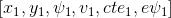
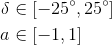
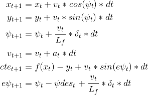
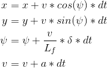

# MP Controller


A C++ implementation of a Model Predictive Controller.

The MP controllers are very popular in different industries
because they allow to handle multivariable problems, are
aware of actuator limitations, allows operation close to constraints
and the specification of objectives is flexible.

This project implements a MPC to drive a car autonomously in
the Udacity simulator.


### The Model

The algorithm for a [Model Predictive Controller](#acknowledgments)
follows this general structure:

* At each sampling instance, a predictive controller:
    1. Takes a measurement of the system state or output
    2. Computes a sequence of inputs over a finite time horizon
        * Using an internal model to predict states at future times
        * Minimising some cost function of future states and inputs
        * While not violating any constraints on states and inputs
    3. Implements the first part of the optimal sequence (discarding the rest)
* Each new measurement is used to calculate a new input
* Prediction horizon recedes with time

This project consider the car as an object moving in a 2D plane so
the model consists of the _x_ and _y_ position, the velocity _v_ and the
heading angle _Ψ_.

Hence the state is represented by:



where _cte_ is the error with respect to ideal path and _epsi_ the
error with respect to the heading.

The actuators (steering angle and throttle) are constrained by



We model the gas and break pedal with only one actuator which is
a realistic simplification.

The equations set for the predicted states are:




### Time Step Length and Elapsed Duration

The values for `N` and `dt` that I have chosen are 25 and 0.1 respectevely.
They allow the car to complete the track with a smooth forward movement
and no jerking.

I tried different values for `N` and `dt`. In the following table I describe the results:

N | dt | Result
--|----|-------
25 | 1.0 | The car starts and stop continuosly.
25 | 0.5 | The forward movement is smoother but it goes off lane.
25 | 0.2 | Completes the circuit but the car breaks too much.
25 | 0.1 | The car move is steady but it goes off road.
20 | 0.1 | Better than 25 but still touches the kerb/ledge.
15 | 0.1 | OK.
10 | 0.1 | OK.
5 | 0.1 | The car goes off lane almost immediatly.


### Cost Function Weights

After some experimentation I decided to heavily penalize
the _cte_ error with a 5X value with respect to _epsi_.

With this set of weights the car tends to go fast but
breaks decisively when it needs to keep the center of
the lane.


### MPC Preprocessing

Converting the waypoints coordinates to a car reference
simplifies the rest of the calcualtions a lot.

To begin with, the current state (without considering
latency) for the variables _x_, _y_ and _Ψ_ are zeros.

This transformation is in the source code at `src/main.cpp:101`.


### Model Predictive Control with Latency

In the real world the actuators have a delay. In this implementation
the latency is simulated by sleeping the thread by 100ms.

To account for this the model needs to predict the current
state given the last measurements. A simple Kinematic model
is effective enough for this delay.



This implementation does not receive the acceleration
measurement from the simulator so it uses the throttle value
which is a good approximation. The source code is at
`src/main.cpp:130`.


### Video Results

Here is a video recording of a simulator run:

[](https://www.youtube.com/watch?v=zxiGR3D2-KA)


---

### Dependencies

* cmake >= 3.5
 * All OSes: [click here for installation instructions](https://cmake.org/install/)
* make >= 4.1
  * Linux: make is installed by default on most Linux distros
  * Mac: [install Xcode command line tools to get make](https://developer.apple.com/xcode/features/)
  * Windows: [Click here for installation instructions](http://gnuwin32.sourceforge.net/packages/make.htm)
* gcc/g++ >= 5.4
  * Linux: gcc / g++ is installed by default on most Linux distros
  * Mac: same deal as make - [install Xcode command line tools]((https://developer.apple.com/xcode/features/)
  * Windows: recommend using [MinGW](http://www.mingw.org/)
* [uWebSockets](https://github.com/uWebSockets/uWebSockets)
  * Run either `install-mac.sh` or `install-ubuntu.sh`.
  * If you install from source, checkout to commit `e94b6e1`, i.e.
    ```
    git clone https://github.com/uWebSockets/uWebSockets 
    cd uWebSockets
    git checkout e94b6e1
    ```
    Some function signatures have changed in v0.14.x. See [this PR](https://github.com/udacity/CarND-MPC-Project/pull/3) for more details.
* Fortran Compiler
  * Mac: `brew install gcc` (might not be required)
  * Linux: `sudo apt-get install gfortran`. Additionall you have also have to install gcc and g++,
  `sudo apt-get install gcc g++`. Look in [this Dockerfile](https://github.com/udacity/CarND-MPC-Quizzes/blob/master/Dockerfile) for more info.
* [Ipopt](https://projects.coin-or.org/Ipopt)
  * Mac: `brew install ipopt`
       +  Some Mac users have experienced the following error:
       ```
       Listening to port 4567
       Connected!!!
       mpc(4561,0x7ffff1eed3c0) malloc: *** error for object 0x7f911e007600: incorrect checksum for freed object
       - object was probably modified after being freed.
       *** set a breakpoint in malloc_error_break to debug
       ```
       This error has been resolved by updrading ipopt with `brew upgrade ipopt --with-openblas` per this
       [forum post](https://discussions.udacity.com/t/incorrect-checksum-for-freed-object/313433/19).
  * Linux
    * You will need a version of Ipopt 3.12.1 or higher. The version available through `apt-get` is 3.11.x. If you can get that version to work great but if not there's a script `install_ipopt.sh` that will install Ipopt. You just need to download the source from the Ipopt [releases page](https://www.coin-or.org/download/source/Ipopt/) or the [Github releases](https://github.com/coin-or/Ipopt/releases) page.
    * Then call `install_ipopt.sh` with the source directory as the first argument, ex: `sudo bash install_ipopt.sh Ipopt-3.12.1`. 
  * Windows: TODO. If you can use the Linux subsystem and follow the Linux instructions.
* [CppAD](https://www.coin-or.org/CppAD/)
  * Mac: `brew install cppad`
  * Linux `sudo apt-get install cppad` or equivalent.
  * Windows: TODO. If you can use the Linux subsystem and follow the Linux instructions.
* [Eigen](http://eigen.tuxfamily.org/index.php?title=Main_Page). This is already part of the repo so you shouldn't have to worry about it.
* Simulator. You can download these from the [releases tab](https://github.com/udacity/self-driving-car-sim/releases).
Not a dependency but read the [DATA.md](./DATA.md) for a description of the data sent back from the simulator.


### Basic Build Instructions


1. Clone this repo.
2. Make a build directory: `mkdir build && cd build`
3. Compile: `cmake .. && make`
4. Run it: `./mpc`.


---

### Acknowledgments

Jan Maciejowski (jmm@eng.cam.ac.uk) from Cambridge University Engineering Department.


### License

This project is published under the [Apache License](http://www.apache.org/licenses/LICENSE-2.0).


### Contributions

I gratefully honor Pull Requests.
Please, consider formatting the code with K&R style and four spaces tabs.


### Who do I talk to?

For questions or requests post an issue here or tweet me at
[@herchu](http://twitter.com/herchu)


